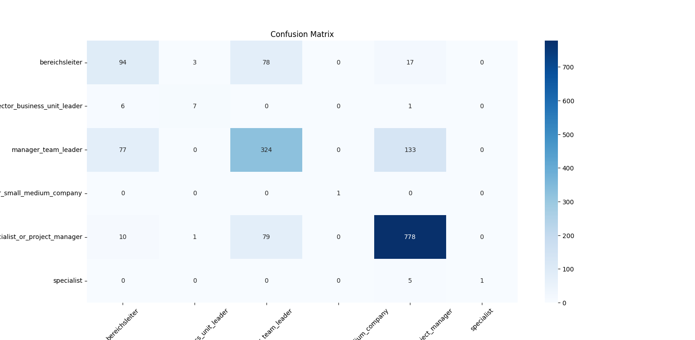
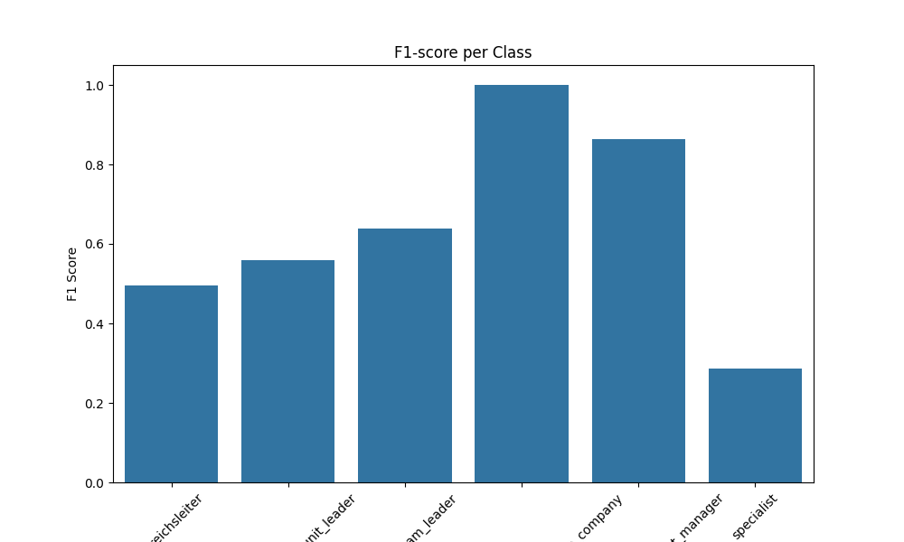
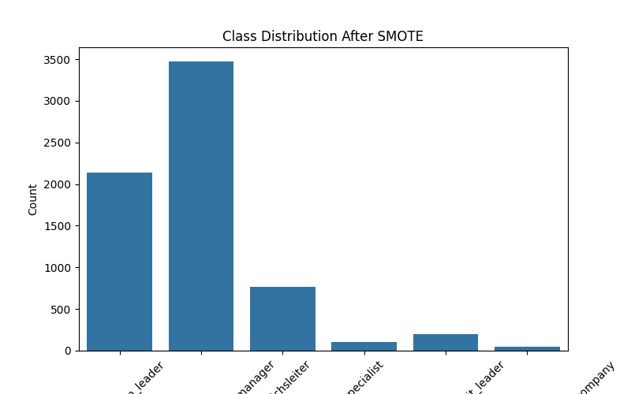

# Career Level Classification using Machine Learning

## Project Overview

This project builds a **machine learning model to predict career levels** based on job-related information such as job title, location, description, function, and industry.

The model processes both **text features and categorical features**, applies **feature engineering**, handles **class imbalance**, and trains a **Logistic Regression classifier optimized with GridSearchCV**.

The goal is to classify job positions into different **career levels**.

---

## Dataset

The dataset contains job information including:

* **title** – job title
* **location** – job location
* **description** – job description text
* **function** – job function category
* **industry** – job industry
* **career_level** – target label (career level classification)

Dataset file location:

```
data/final_project.ods
```

---

## Project Structure

```
career-level-classifier
│
├── data
│   └── final_project.ods
│
├── src
│   └── train_model.py
│
├── outputs
│   ├── confusion_matrix.png
│   ├── f1_score.png
│   └── class_distribution.png
│
├── models
│   └── model.pkl
│
├── README.md
├── requirements.txt
└── LICENSE
```

---

## Machine Learning Pipeline

The model uses a **Scikit-learn Pipeline** to combine preprocessing and training.

### Feature Engineering

1. **TF-IDF Vectorization**

   * Applied to:

     * title
     * description
     * industry

2. **OneHot Encoding**

   * Applied to:

     * location
     * function

3. **ColumnTransformer**

   * Combines text and categorical transformations.

---

## Handling Imbalanced Data

The dataset is imbalanced, so the project uses:

**SMOTEN (Synthetic Minority Over-sampling Technique for Nominal data)**

to oversample minority classes before training.

---

## Model

The final classifier is:

**Logistic Regression**

with hyperparameter tuning using **GridSearchCV**.

Grid search parameters:

```
C = [0.01, 0.1, 1, 10]
penalty = l2
class_weight = [None, balanced]
```

Evaluation metric:

```
F1 Macro Score
```

---

## Evaluation Metrics

The model evaluation includes:

* Classification Report
* Confusion Matrix
* F1-score per class
* Class distribution visualization

---

## Visualizations

### Confusion Matrix

Shows prediction performance across all classes.




### F1 Score per Class



### Class Distribution After SMOTE




## Model Saving

After training, the best model is saved as:

```
models/model.pkl
```

This allows the model to be reused without retraining.

---

## Installation

Clone the repository and install dependencies.

```
pip install -r requirements.txt
```

---

## Run the Project

Run the training script:

```
python src/train_model.py
```

This will:

1. Load and preprocess the dataset
2. Train the machine learning model
3. Perform hyperparameter tuning
4. Evaluate the model
5. Save visualizations
6. Save the trained model

---

## Technologies Used

* Python
* Pandas
* Scikit-learn
* Imbalanced-learn
* Matplotlib
* Seaborn
* TF-IDF Vectorization
* GridSearchCV

---

## Author

Dang Duc Anh
